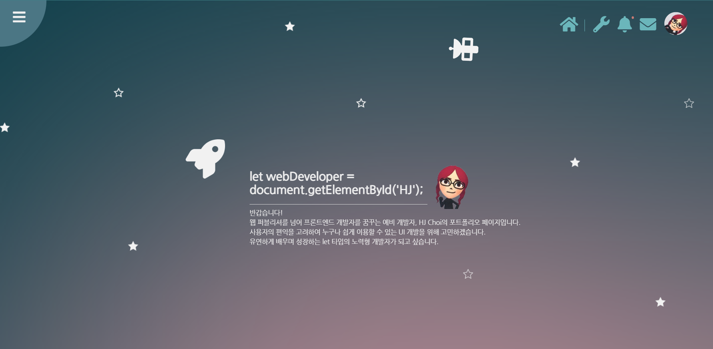

## ✨포트폴리오 페이지

https://blackdogumjung.github.io/portfolio/

### 🤔Summary
유연하고 새롭게 사고하며, 문제의 빠른 해결을 도출하는 프론트엔드 개발자가 되고자 공부하고 있습니다.

### 🐱‍🏍SKILL
**HTML** 
SEO에 유리한 마크업 구조로 웹 표준, 접근성을 준수합니다.

**Bootstrap** 
부트스트랩을 활용한 빠른 조립식 웹페이지를 구현할 수 있습니다.

**CSS** 
FLEX와 GRID의 활용이 자유로우며 미디어 쿼리를 바탕으로 한 반응형 웹을 구현합니다. 

**SCSS** 
CSS 컴파일링 방법과 변수 저장, 반응형 미디어 쿼리와 @use, @mixin, @extend 문법을 이해하고 있습니다.

**Vanila JS** 
객체와 배열를 이해하여 반응형 웹앱을 구현합니다. ES6 신문법을 학습하여 prototype을 이해합니다.

**Jquery** 
JS 라이브러리를 사용한 이벤트 구현이 가능합니다.

**REACT** 
컴포넌트 구조와 props, states를 이해하고 있으며, 데이터 전송을 위한 객체 지향 함수를 선호합니다. (선행 학습을 위해 VUE 이론을 공부하였습니다.)

**Node.js, MongoDB** 
프론트엔드의 데이터 연결, 자료구조 이해를 위하여 이론을 습득하였습니다.

💥주요 기능
* 디자인, 코딩 100%, 반응형 
* flex를 이용한 work 페이지, CSS animation 활용
* 왼쪽 상단의 클릭 기능 이용한 페이지 UP 기능 
* EMAIL.JS를 이용하여 실제 메시지를 받을 수 있도록 구현 
* fontawesome 활용

### 🛠Tech
* HTML, CSS, JS, JQUERY
